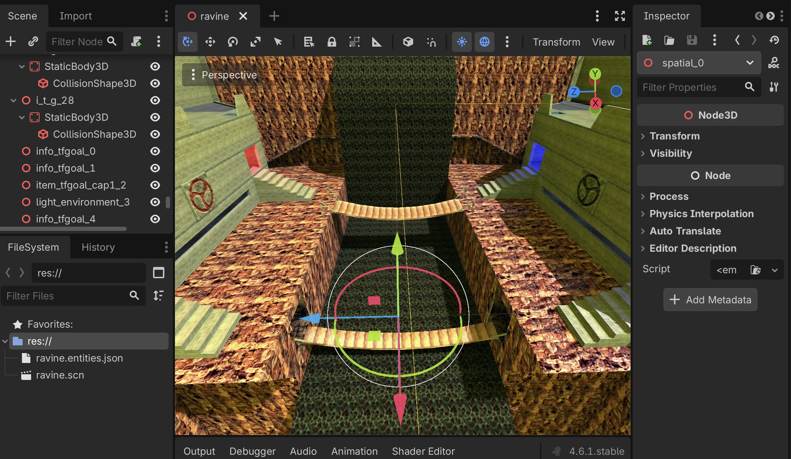

# goldsrc-godot

A Godot 4.3+ GDExtension for loading GoldSrc (Half-Life 1) engine assets: BSP maps, MDL models, SPR sprites, and WAD texture archives.



## Features

### BSP Maps
- Full BSP30 format with face-based mesh generation
- Atlas-packed lightmaps with 64 lightstyle channels and runtime rebaking
- Embedded and WAD-referenced textures with transparency (`{` prefix alpha-scissor)
- Hull 0 collision (StaticBody3D for worldspawn, AnimatableBody3D for brush entities)
- Clip brush reconstruction from hull 1 clipping data — un-expands Minkowski-expanded hull planes back to original brush geometry, then clips against hull 0 to recover invisible collision brushes that have no render faces
- Water volume extraction as Area3D with ConvexPolygonShape3D
- Automatic occluder generation (OccluderInstance3D + PolygonOccluder3D) — see [Occluder Generation](#occluder-generation) below
- PVS (Potentially Visible Set) data parsing with RLE decompression — used by `debug_occluders` mode to validate occluder effectiveness against the BSP's precomputed visibility data
- Worldspawn spatial splitting — walks the BSP tree to group faces into spatial clusters, producing separate MeshInstance3D nodes per group for better frustum culling
- Brush entity geometry wrapped in AnimatableBody3D ("Body") with meshes and collision inside, ready for GDScript movement without body conversion
- Point entity nodes (Node3D) with entity properties stored as metadata — classname, targetname, origin, angles, and all other key-value pairs are accessible from GDScript via `node.get_meta("entity")`
- Entity lump parsing (key-value dictionaries accessible from GDScript)
- Debug hull visualization meshes (optional) — renders solid/empty cells for collision debugging
- **Ambient cube light grid baking** — traces rays in 6 directions from a 3D grid through the BSP tree, samples lightmaps at hit points, and outputs slice images for `ImageTexture3D` construction. Includes flood-fill of solid cells to prevent trilinear interpolation artifacts. Provides spatially-varying directional ambient lighting for dynamic models

### MDL Models
- Skeleton3D with full bone hierarchy
- Skinned meshes with per-vertex bone weights
- All animation sequences as AnimationPlayer tracks
- Chrome and additive material flags
- Configurable scale factor

### SPR Sprites
- All frame types (single and grouped)
- Texture formats: normal, additive, index-alpha, alpha-test
- Sprite types: parallel, facing-upright, oriented, etc.
- Frame textures accessible individually from GDScript

### WAD Textures
- WAD2/WAD3 format support
- Palette-based to RGBA conversion with auto-generated mipmaps
- Case-insensitive texture lookup
- Per-texture caching

## Editor Import Plugins

Drop files into a project and they auto-import:

| Format | Extension | Output | Description |
|--------|-----------|--------|-------------|
| BSP | `.bsp` | `.scn` | PackedScene with meshes, lightmaps, collision |
| MDL | `.mdl` | `.scn` | PackedScene with Skeleton3D, meshes, animations |
| SPR | `.spr` | `.tres` | SpriteFrames resource with all frames |
| WAD | `.wad` | `.png` files | Extracts individual textures as PNGs |

All imported scenes contain only standard Godot types (Node3D, MeshInstance3D, ArrayMesh, Skeleton3D, AnimationPlayer, StaticBody3D, AnimatableBody3D, OccluderInstance3D, etc.) and do **not** require the GDExtension at runtime.

### Headless Batch Conversion

Convert BSP maps from the command line without opening the editor:

```bash
godot --path <project-dir> --script res://tools/batch_convert_bsp.gd -- \
  --bsp map1.bsp --bsp map2.bsp \
  --wad-dir /path/to/wads \
  --output-dir /path/to/output \
  --scale 0.025 \
  --shader-lightstyles \
  --overbright 2.0 \
  --rotate
```

Options:
- `--bsp` — input BSP file (repeat for multiple maps)
- `--wad-dir` — directory containing `.wad` files for texture lookup
- `--output-dir` — where to write `.scn` files
- `--scale` — coordinate scale factor (default: `0.025`)
- `--shader-lightstyles` — use shader-based lightstyle animation
- `--overbright` — lightmap brightness multiplier (default: `1.0`)
- `--rotate` — rotate 180 degrees around Y to match alternate coordinate conventions

Outputs a `.scn` PackedScene file per map with all geometry, collision, occluders, and entity nodes baked in.

## Occluder Generation

The importer automatically generates `OccluderInstance3D` + `PolygonOccluder3D` nodes for worldspawn wall geometry. To use them at runtime, enable **Project Settings > Rendering > Occlusion Culling > Use Occlusion Culling**.

### Algorithm

1. **Face collection** — worldspawn wall faces are gathered (floors/ceilings, sky, water, transparent, and tool textures excluded).
2. **Coplanar grouping** — faces are grouped by quantized plane key (normal + distance) to find walls that share a plane.
3. **Connected components** — within each plane group, union-find on shared vertices identifies contiguous face patches.
4. **Boundary edge merging** — shared interior edges cancel out, leaving only the true outer boundary of each patch (plus any interior holes from doorways/windows).
5. **Loop classification**:
   - **Single loop** → solid wall, one merged occluder.
   - **Multiple loops, holes BSP-solid** → the "holes" are backed by solid geometry (e.g. recessed detail), so one merged occluder from the outer loop is safe.
   - **Multiple loops, real openings** → doorways/windows detected via BSP tree traversal. The algorithm re-runs edge cancellation on only the qualifying faces (area ≥ `occluder_min_area`). Adjacent solid panels merge into one occluder; the doorway spaces become the natural exterior boundary rather than interior holes.
6. **Boundary filtering** — faces whose plane sits within `occluder_boundary_margin` GoldSrc units of the worldspawn bbox are skipped. Players can never be on both sides of an outer-hull face, so it provides no occlusion value.
7. **Polygon cleanup** — duplicate and collinear vertices are removed, and each polygon is pre-validated against Godot's triangulator before being committed as an occluder.

### Import Parameters

| Parameter | Default | Description |
|-----------|---------|-------------|
| `occluder_min_area` | 65535 | Minimum face area in GoldSrc units² for a face to qualify as an occluder. ~256×256 at default. Raise to get fewer, larger occluders; lower to include smaller walls. |
| `occluder_boundary_margin` | 512 | Faces within this many GoldSrc units of the map's bounding box boundary are skipped. |

These can be set per-map in the Godot Import tab or directly in the `.bsp.import` file:

```ini
[params]
occluder_min_area=65535.0
occluder_boundary_margin=512.0
```

### Debug Mode

Set `debug_occluders = true` on the `GoldSrcBSP` node before calling `build_mesh()` to print a full pipeline report including: face counts, component breakdown by type (solid/solid-holes/real-openings/walk-failures), occluder coverage percentage, overfill checks on merged polygons, and PVS validation (what fraction of BSP-invisible leaf pairs have an occluder plane between them).

## Building

Requires CMake 3.22+ and a C++17 compiler.

```bash
git clone --recursive https://github.com/alanfischer/goldsrc-godot.git
cd goldsrc-godot
mkdir build && cd build
cmake ..
make -j8
```

The compiled library goes to `addons/goldsrc/bin/`. Open the project in Godot and enable the GoldSrc plugin under Project Settings > Plugins.

## GDScript API

### GoldSrcBSP

```gdscript
var bsp = GoldSrcBSP.new()
bsp.scale_factor = 0.025

var wad = GoldSrcWAD.new()
wad.load_wad("textures.wad")
bsp.add_wad(wad)

bsp.load_bsp("map.bsp")
bsp.build_mesh()

# Entity data is on the child nodes as metadata:
for child in bsp.get_children():
    if child.has_meta("entity"):
        var ent = child.get_meta("entity")  # Dictionary
        print(ent.get("classname", ""))
        print(ent.get("targetname", ""))

# Or get raw entity dictionaries:
var entities = bsp.get_entities()  # Array of Dictionaries

# Optional: debug visualization of clip hull collision cells
bsp.build_debug_hull_meshes(1)  # hull index 1-3

# Optional: tune occluder generation (before build_mesh)
bsp.occluder_min_area = 65535.0       # min face area in GoldSrc units²
bsp.occluder_boundary_margin = 512.0  # skip faces near outer map hull
bsp.debug_occluders = true            # prints PVS validation, overfill checks, pipeline stats

# Bake ambient cube light grid (call after build_mesh)
var grid = bsp.bake_light_grid(32.0)  # cell size in GoldSrc units
# Returns Dictionary with:
#   grid_origin: Vector3 — world-space origin in Godot coords
#   grid_dims: Vector3i — grid dimensions in Godot coords (X, Y, Z)
#   cell_size: float — cell size in Godot units
#   dir_slices: Array of 6 Arrays of Images — one per axis direction
#     (+X, -X, +Y, -Y, +Z, -Z), each array contains depth-slice Images
#     for ImageTexture3D construction
```

### GoldSrcMDL

```gdscript
var mdl = GoldSrcMDL.new()
mdl.scale_factor = 0.025
mdl.load_mdl("model.mdl")
mdl.build_model()

print(mdl.get_sequence_count())    # Number of animations
print(mdl.get_sequence_name(0))    # First animation name
print(mdl.get_bone_count())        # Number of bones
```

### GoldSrcSPR

```gdscript
var spr = GoldSrcSPR.new()
spr.load_spr("sprite.spr")

var frame_count = spr.get_frame_count()
var texture = spr.get_frame_texture(0)  # ImageTexture
var spr_type = spr.get_type()           # SPR_VP_PARALLEL, etc.
```

### GoldSrcWAD

```gdscript
var wad = GoldSrcWAD.new()
wad.load_wad("textures.wad")

var names = wad.get_texture_names()     # PackedStringArray
var tex = wad.get_texture("concrete1")  # ImageTexture
```

## Coordinate System

GoldSrc uses Z-up; Godot uses Y-up. The plugin converts automatically:
- Positions: `(x, y, z)` &rarr; `(-x * scale, z * scale, y * scale)`
- Quaternions: conjugation by -90&deg; X rotation

Default scale factor is `0.025` (1 GoldSrc unit = 0.025 Godot units).
